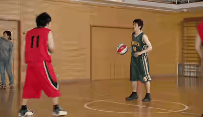

# A Toolbox for Video Restoration
[](https://mp.weixin.qq.com/s/0Hqp2A8pjo1_Gn23LEpPXg)
[](https://zhuanlan.zhihu.com/p/563455469)


[](https://paperswithcode.com/sota/deblurring-on-dvd-1?p=flow-guided-sparse-transformer-for-video)
[](https://paperswithcode.com/sota/deblurring-on-dvd?p=flow-guided-sparse-transformer-for-video)
[](https://paperswithcode.com/sota/deblurring-on-gopro?p=flow-guided-sparse-transformer-for-video)
	
[](https://paperswithcode.com/sota/video-super-resolution-on-vimeo90k?p=unsupervised-flow-aligned-sequence-to)
[](https://paperswithcode.com/sota/deblurring-on-gopro?p=unsupervised-flow-aligned-sequence-to)
[](https://paperswithcode.com/sota/video-enhancement-on-mfqe-v2?p=unsupervised-flow-aligned-sequence-to)


#### Authors

 [Jing Lin*](https://scholar.google.com/citations?hl=zh-CN&user=SvaU2GMAAAAJ), [Yuanhao Cai*](https://caiyuanhao1998.github.io), [Xiaowan Hu](https://scholar.google.com/citations?user=a_WRvyIAAAAJ&hl=zh-CN), [Haoqian Wang](https://scholar.google.com.hk/citations?user=eldgnIYAAAAJ&hl=zh-CN), [Youliang Yan](https://scholar.google.com/citations?user=JPUwfAMAAAAJ&hl=th), [Xueyi Zou](https://xueyizou.github.io/), [Henghui Ding](https://henghuiding.github.io/), [Yulun Zhang](yulunzhang.com), [Radu Timofte](https://people.ee.ethz.ch/~timofter/), and [Luc Van Gool](https://ee.ethz.ch/the-department/faculty/professors/person-detail.OTAyMzM=.TGlzdC80MTEsMTA1ODA0MjU5.html)


#### News
- **2022.08.05 :** Pretrained model of FGST on GOPRO dataset is released. :rocket: 
- **2022.05.14 :** Our FGST and S2SVR are accepted by ICML2022. :rocket: 

|            *Super-Resolution*             |             *Deblur*             |            *Compressed Video Enhancement*             |
| :------------------------------: | :-------------------------------: |  :-------------------------------: |
|  |  |  |

#### Papers
- [Flow-Guided Sparse Transformer for Video Deblurring (ICML 2022)](https://arxiv.org/abs/2201.01893)
- [Unsupervised Flow-Aligned Sequence-to-Sequence Learning for Video Restoration (ICML 2022)](https://arxiv.org/abs/2205.10195)

## 1. Create Environment:

- Python 3 (Recommend to use [Anaconda](https://www.anaconda.com/download/#linux))

- NVIDIA GPU + [CUDA](https://developer.nvidia.com/cuda-downloads)

- Python packages:

```shell
pip install torchvision==0.9.0  torch==1.8.0  torchaudio==0.8.0
pip install -r requirements.txt
pip install openmim
mim install mmcv-full
pip install -v -e .
pip install cupy-cuda101==7.7.0
```

## 2. Prepare Dataset:

Download the datasets ([GOPRO](https://seungjunnah.github.io/Datasets/gopro),[DVD](https://www.cs.ubc.ca/labs/imager/tr/2017/DeepVideoDeblurring/#dataset),[REDS](https://seungjunnah.github.io/Datasets/reds.html),[VIMEO](http://toflow.csail.mit.edu/),[MFQE-v2](https://github.com/ryanxingql/mfqev2.0/wiki/MFQEv2-Dataset)) and and recollect them as the following form:

```shell
|--VR-Baseline
    |--data
    	|-- GoPro
    	    |-- test
    	    |-- train
    	|-- DVD
    	    |-- test
    	    |-- train
    	|-- REDS
    	    |-- test
    	    |-- train
    	|-- VIMEO
    	    |-- test
    	    |-- train
    	|-- MFQEV2
    	    |-- test
    	    |-- train
```

To recollect GoPro dataset, you can run the following command:
```shell
cd /VR-Baseline/data_preparation
python GoPro_Util.py --input_path INPUT_PATH --save_path SAVE_PATH
```
You need to replace `INPUT_PATH` and `SAVE_PATH` with your own path.

## 3. Training:

```shell
cd VR_Baseline

# training FGST on GoPro dataset
bash tools/dist_train.sh configs/FGST_deblur_gopro.py 8

# training FGST on DVD dataset
bash tools/dist_train.sh configs/DVD_deblur_gopro.py 8

# training S2SVR on GoPro dataset
bash tools/dist_train.sh configs/S2SVR_deblur_gopro.py 8

# training S2SVR on REDS dataset
bash tools/dist_train.sh configs/S2SVR_sr_reds4.py 8

# training S2SVR on MFQEv2 dataset
bash tools/dist_train.sh configs/S2SVR_vqe_mfqev2.py 8
```

The training log, trained model will be available in `VR-Baseline/experiments/` . 


## 4. Testing:

Download [pretrained model](https://drive.google.com/drive/folders/1cmT0ti0-XwuCMcAhVEQWcD6rqCEwLo2T?usp=sharing) and run the following command.

```python
python demo/restoration_video_demo.py ${CONFIG} ${CHKPT} ${IN_PATH} ${OUT_PATH}
```

## 5.  TODO 

These works are mostly done during the internship at [HUAWEI Noah's Ark Lab](http://dev3.noahlab.com.hk/). Due to the limitation of company regulations, the original pre-trained models can not be transferred and published here. We will retrain more models and open-source them when we have enough GPUs as soon as possible. 

- [ ] More Pretrained Models
- [ ] Inference Results

## 6.  Acknowledgement.

We refer to codes from [BasicVSR++](https://github.com/ckkelvinchan/BasicVSR_PlusPlus) and [mmediting](https://github.com/open-mmlab/mmediting). Thanks for their awesome works.

## 7. Citation

If this repo helps you, please consider citing our works:

```shell

# FGST
@inproceedings{fgst,
  title={Flow-Guided Sparse Transformer for Video Deblurring},
  author={Lin, Jing and Cai, Yuanhao and Hu, Xiaowan and Wang, Haoqian and Yan, Youliang and Zou, Xueyi and Ding, Henghui and Zhang, Yulun and Timofte, Radu and Van Gool, Luc},
  booktitle={ICML},
  year={2022}
}


# S2SVR
@inproceedings{seq2seq,
  title={Unsupervised Flow-Aligned Sequence-to-Sequence Learning for Video Restoration},
  author={Lin, Jing  and Hu, Xiaowan and Cai, Yuanhao and Wang, Haoqian and Yan, Youliang and Zou, Xueyi and Zhang, Yulun and Van Gool, Luc},
  booktitle={ICML},
  year={2022}
}
```
